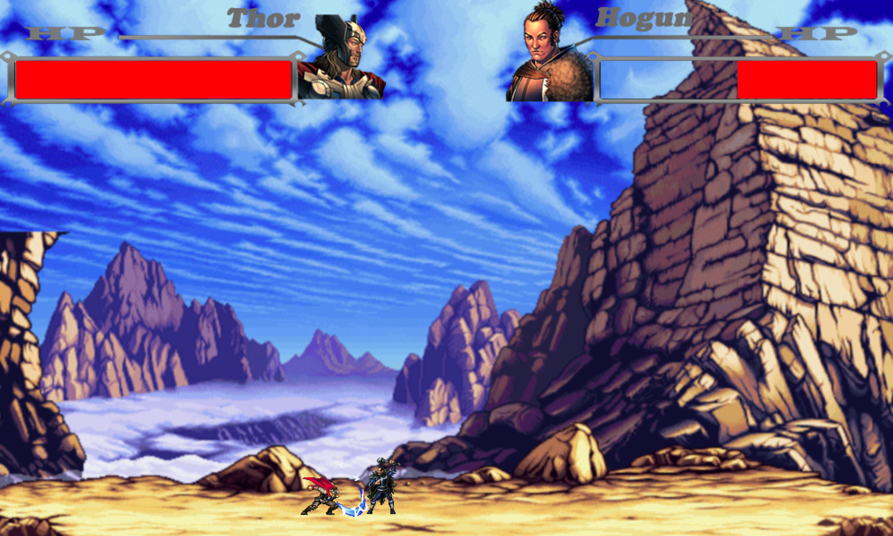

# Marvel Themed Street Fighter Made in Python

My take on a Marvel themed version of the popular game, Street Fighter. Created using Python and the Pygame library. Implemented design and game features including 2 player mode, collision detection and sound effects.

Runs on Python 2.7.2 and PyGame 1.9.1.

